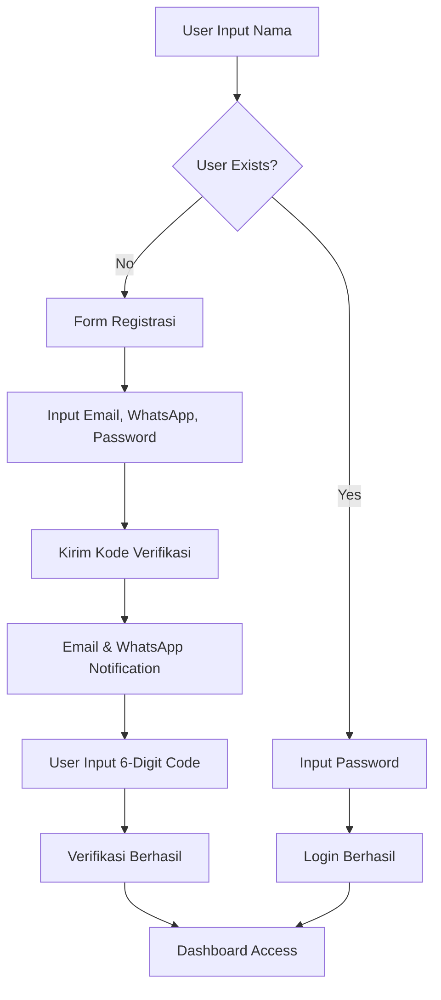
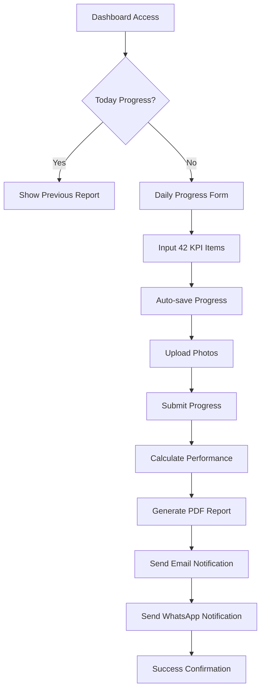
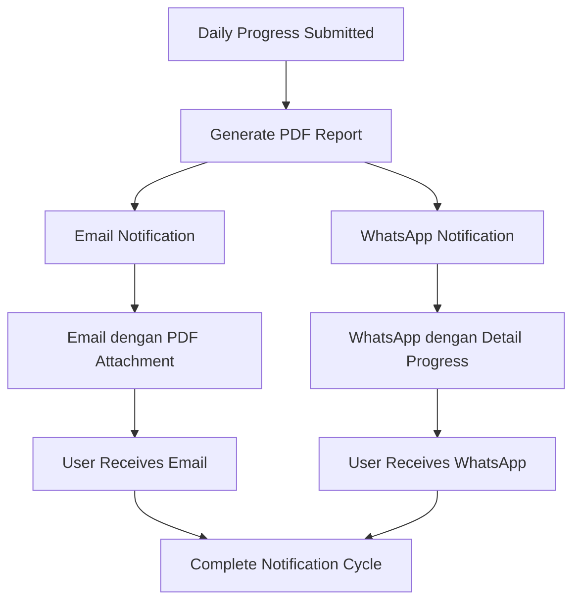

# Report Daily Helper-PMI

<p align="center">
    
</p>

<p align="center">
    <em>Aplikasi Pencatatan Laporan Harian Penjualan untuk Sales Philip Morris International</em>
</p>

---

## 📋 Tentang Aplikasi

**Report Daily Helper-PMI** adalah sistem manajemen KPI (Key Performance Indicator) yang dirancang khusus untuk sales representative Philip Morris International di bawah brand Sampoerna. Aplikasi ini menyediakan platform digital untuk pencatatan laporan harian, tracking performa, dan generasi laporan otomatis dengan notifikasi email dan WhatsApp.

### 🎯 Tujuan Utama
- Memfasilitasi pencatatan laporan harian sales dengan mudah dan efisien
- Menyediakan tracking performa real-time dengan sistem persentase otomatis
- Menghasilkan laporan PDF profesional untuk keperluan manajemen
- Mengirimkan notifikasi otomatis melalui email dan WhatsApp
- Menyediakan dashboard admin untuk monitoring performa tim

---

## 🌟 Fitur Utama

### 🔐 Sistem Autentikasi Multi-Step
- **Name-based User Lookup**: Sistem mencari user berdasarkan nama lengkap
- **Auto-Registration**: Pendaftaran otomatis untuk user baru
- **Email Verification**: Verifikasi dengan kode 6-digit dikirim ke email dan WhatsApp
- **Session Management**: Penyimpanan sesi dengan local storage

### 📊 Tracking KPI Komprehensif
- **42 Item KPI** tersebar dalam 8 kategori:
  - **Visit**: Plan Visit, Actual Visit, OOR Outlet, Eff Outlet
  - **Ecosystem**: Login/submit di berbagai platform
  - **Volume**: Volume produk (DTC12, NAT20, TWP16, VEEV, KBL12)
  - **Eff Call**: Efektivitas kunjungan per produk
  - **Av Out**: Rata-rata outlet per produk
  - **Stick Selling**: Performa penjualan batang
  - **Private Label & Cricket**: Metric khusus produk
  - **Others**: Bookmarking, PVP, referral, compliance

### 📱 User Experience Optimal
- **Responsive Design**: Dioptimalkan untuk mobile dan desktop
- **Auto-save**: Penyimpanan otomatis data progress (setiap 500ms)
- **Photo Documentation**: Upload foto dokumentasi dengan Cloudinary (max 20 foto)
- **Backdate Submission**: Kemampuan input laporan untuk tanggal sebelumnya
- **Performance Calculation**: Kalkulasi persentase otomatis dengan target 70%

### 📈 Analytics & Reporting
- **Calendar View**: Tampilan kalender dengan indikator progress harian
- **PDF Generation**: Laporan harian dan bulanan dalam format PDF profesional
- **Performance Tracking**: Monitoring performa dengan color-coded indicators
- **Historical Data**: Akses riwayat laporan dengan navigasi bulanan

---

## 🚀 Alur Kerja Aplikasi

### 1. Proses Registrasi & Verifikasi



### 2. Workflow Laporan Harian



### 3. Sistem Notifikasi



---

## 📧 Sistem Email & WhatsApp

### 📮 Email Notifications

#### 1. Email Verifikasi
- **Template**: HTML profesional dengan branding PMI
- **Konten**: Kode verifikasi 6-digit dengan tombol copy-to-clipboard
- **Keamanan**: Kode berlaku 15 menit, peringatan keamanan
- **Design**: Responsive untuk semua perangkat

#### 2. Email Laporan Harian
- **Trigger**: Otomatis setelah submit progress
- **Attachment**: PDF laporan harian lengkap
- **Konten**: 
  - Summary performa dengan persentase
  - Breakdown per kategori KPI
  - Progress bars untuk setiap item
  - Feedback message berdasarkan performa
  - Charts dan statistik visual

### 📱 WhatsApp Integration (via Fonnte)

#### 1. Verifikasi WhatsApp
```
🔐 Verifikasi Email
Report Daily Helper - Philip Morris International

Halo [Nama]! 👋

Kode Verifikasi Anda: [6-digit code]
Berlaku selama 15 menit

Mohon jangan bagikan kode ini kepada siapa pun.
```

#### 2. Laporan Harian WhatsApp
```
📊 Daily Report DPC Sibolga TPSP036
Hari/Tanggal: [Tanggal dalam format Indonesia]

🎯 Visit:
- Plan Visit: [nilai]
- Actual Visit: [nilai]
- OOR Outlet: [nilai]
- Eff Outlet: [nilai]

🌐 Ecosystem:
- [Detail platform logins dan submissions]

📈 Volume:
- DTC12: [nilai]
- NAT20: [nilai]
- TWP16: [nilai]
- VEEV: [nilai]
- KBL12: [nilai]

📞 Eff Call:
- [Efektivitas per produk]

🏪 Av Out:
- [Rata-rata outlet per produk]

💰 Stick Selling:
- [Performa penjualan batang]

🏷️ Private Label & Cricket:
- [Metric khusus]

📋 Others:
- [Bookmarking, PVP, referral, compliance]

Overall Performance: [XX]%

Sekian Laporan dari [Nama]
Demikian, terima kasih pak 🙏🏻
```

---

## 📄 Sistem PDF Reports

### 📑 Laporan Harian PDF

#### Informasi yang Disediakan:
- **Header**: Informasi user (nama, email, username, tanggal)
- **Performance Summary**: Persentase overall dengan status indicator
- **Category Breakdown**: Tabel detail per kategori dengan:
  - Target vs Actual values
  - Individual percentages
  - Color-coded performance (🟢 ≥70%, 🟡 ≥50%, 🔴 <50%)
- **Photo Documentation**: Grid layout 3-kolom dengan caption
- **Professional Formatting**: Branding PMI dengan header/footer

#### Status Indicators:
- **ACHIEVED** (≥70%): Performa Excellent
- **GOOD** (≥50%): Performa Good
- **NEEDS IMPROVEMENT** (<50%): Perlu perbaikan

### 📊 Laporan Bulanan PDF

#### Analytics Komprehensif:
- **Summary Statistics**:
  - Completion rate (% hari dengan submission)
  - Average performance bulanan
  - Best vs worst performance days
  - Progress days vs total days
- **Category Performance**: Aggregate performance per kategori
- **Daily Progress Table**: Detail semua submission bulanan
- **Performance Trends**: Analisis konsistensi dan pola
- **Achievement Rates**: Tingkat pencapaian per kategori

**Requirements**: Minimum 20 hari data untuk generate laporan bulanan

---

## 👥 Manajemen User & Role

### 🙋‍♂️ Regular Users
- Submit laporan harian dengan 42 KPI items
- View history personal dengan calendar view
- Generate & download laporan PDF
- Upload dokumentasi foto (max 20 per submission)
- Auto-save functionality untuk mencegah data loss
- Backdate submission untuk tanggal sebelumnya

### 🔧 Admin Users
- **All regular user capabilities**
- **User Management**:
  - View all users dengan statistics
  - Promote/demote admin privileges
  - Delete user accounts
  - Access user history dan reports
- **System Analytics**:
  - Total users dan active users bulanan
  - Daily progress submissions
  - Average performance metrics
  - Top performer rankings

---

## 🔧 Teknologi & Integrasi

### 🌐 Tech Stack
- **Backend**: Laravel 10 dengan PHP 8.2
- **Frontend**: Alpine.js dengan TailwindCSS
- **Database**: MySQL dengan Eloquent ORM
- **Email Service**: Laravel Mail dengan SMTP
- **WhatsApp Service**: Fonnte API integration
- **Cloud Storage**: Cloudinary untuk photo uploads
- **PDF Generation**: Laravel PDF library

### 📡 External Services
- **Cloudinary**: Cloud-based image upload dan storage
- **Fonnte**: WhatsApp Business API untuk notifications
- **Email SMTP**: Reliable email delivery service

### 🔒 Security Features
- **CSRF Protection**: Semua forms dilindungi CSRF token
- **Data Validation**: Server-side validation untuk semua input
- **Email Verification**: Mandatory email verification untuk akun baru
- **Role-based Access**: Kontrol akses berdasarkan role user
- **Secure File Upload**: Validasi file type dan size limits

---

## 📈 Data Collection & Analytics

### 📊 Data Points
- **User Profile**: Nama, email, WhatsApp, username, verification status
- **Daily Progress**: 42 KPI metrics dengan target vs actual values
- **Performance Metrics**: Persentase calculation dan status classification
- **Photo Documentation**: Cloudinary URLs dengan metadata
- **Historical Data**: Time-series data untuk trend analysis

### 🎯 Performance Calculation
```
Individual Item % = (Actual Value / Target Value) × 100
Overall Performance % = Average of all valid item percentages
Classification:
- Excellent: ≥70%
- Good: ≥50%
- Needs Improvement: <50%
```

### 💾 Auto-save System
- **Real-time Protection**: Auto-save setiap 500ms setelah input
- **Local Storage**: Persistence dengan user-specific keys
- **Visual Indicators**: Status icons (saving, saved, failed)
- **Data Recovery**: Automatic recovery on page reload
- **Cleanup**: Cleared setelah successful submission

---

## 🎨 User Interface & Experience

### 📱 Mobile-First Design
- **Responsive Layout**: Optimal untuk smartphone dan tablet
- **Touch-friendly**: Minimum 44px touch targets
- **Fast Loading**: Optimized assets dan lazy loading
- **Offline Capabilities**: Local storage untuk draft submissions

### 🎭 Visual Design
- **Modern UI**: Clean, professional interface
- **Color-coded Indicators**: Easy-to-understand performance metrics
- **Progressive Enhancement**: Graceful degradation untuk older browsers
- **Accessibility**: ARIA labels dan keyboard navigation

---

## 🔄 Workflow Automation

### ⚡ Automated Processes
1. **User Registration**: Auto-generate username dari email
2. **Email Verification**: Automatic code generation dan expiry
3. **Progress Calculation**: Real-time percentage calculation
4. **Report Generation**: Automatic PDF creation setelah submission
5. **Notifications**: Dual-channel notification (email + WhatsApp)
6. **Data Backup**: Auto-save dan local storage persistence

### 🔄 Business Logic
- **One submission per day**: Prevent duplicate submissions
- **Future date prevention**: Tidak bisa submit untuk tanggal akan datang
- **Backdate capability**: Input laporan untuk tanggal sebelumnya
- **Target-based scoring**: Flexible target configuration
- **Multi-level approval**: Admin oversight capabilities

---

## 🎯 Business Impact

### 📈 Manfaat untuk Sales Representative
- **Efisiensi**: Mengurangi waktu untuk laporan harian
- **Akurasi**: Kalkulasi otomatis mengurangi human error
- **Tracking**: Real-time monitoring performa personal
- **Documentation**: Photo upload untuk bukti kunjungan
- **Motivation**: Instant feedback dan performance indicators

### 🏢 Manfaat untuk Management
- **Visibility**: Real-time monitoring performa tim
- **Analytics**: Comprehensive reporting dan trends
- **Efficiency**: Automated report generation
- **Compliance**: Standardized reporting format
- **Decision Support**: Data-driven insights untuk strategy

---

## 🔍 Monitoring & Maintenance

### 📊 System Monitoring
- **Performance Metrics**: Response time dan uptime monitoring
- **Error Logging**: Comprehensive error tracking
- **User Analytics**: Usage patterns dan feature adoption
- **Security Monitoring**: Failed login attempts dan suspicious activity

### 🔧 Maintenance Features
- **Database Optimization**: Efficient queries dan indexing
- **Cache Management**: Redis untuk performance optimization
- **Backup System**: Regular database dan file backups
- **Update Management**: Seamless deployment process

---

## 🎉 Kesimpulan

**Report Daily Helper-PMI** adalah solusi komprehensif yang berhasil mengotomatisasi proses pelaporan harian sales dengan fitur-fitur canggih seperti:

✅ **User Experience Excellence**: Interface responsive dengan auto-save dan mobile optimization  
✅ **Comprehensive Analytics**: 42 KPI items dengan calculation otomatis  
✅ **Multi-channel Notifications**: Email + WhatsApp integration  
✅ **Professional Reporting**: PDF generation dengan branding PMI  
✅ **Admin Management**: Role-based access dengan analytics dashboard  
✅ **Security**: CSRF protection, email verification, dan data validation  
✅ **Scalability**: Cloud-based storage dan efficient architecture  

Aplikasi ini tidak hanya meningkatkan efisiensi proses pelaporan, tetapi juga memberikan insights valuable untuk pengambilan keputusan strategis di level management.

---

<p align="center">
    <em>Dikembangkan oleh <strong>Bintang Tobing</strong></em><br>
    <em>untuk Philip Morris International - Sampoerna Brand</em>
</p>

<p align="center">
    <a href="https://kpi-sampoerna.bintangtobing.com" target="_blank">🌐 Live Demo</a>
</p>